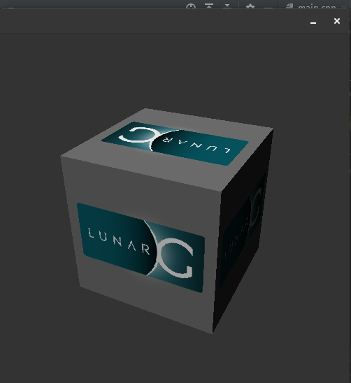
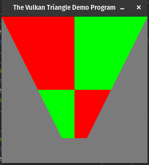
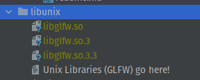

# OUGDASM

---
OUGDASM (OUGDA + ACM) is a renderer example project developed for the purposes of education 
with the usage of the Vulkan renderer. This repository contains an example project that is
a great springboard for learning about the Vulkan renderer, or attempting to make a small
educational project within it. This is not set up to create large projects. If you would like
to do that, your first step should be replacing GLFW with SDL.

# Install
Currently, I have the ability set-up both a Windows and Linux executable.

## Windows
1. Clone the repo into a folder of your choosing.
2. Install MinGW, and ensure it works. I suggest using [Chocolatey Package Manager](https://chocolatey.org/).
You **can** use MSVC, however you will likely have to mess with the CMakeLists!
   1. Navigate to chocolatey.org/install
   2. Run the script under 'Install Chocolatey for Indivdual use'
   3. Restart your shell
   4. Run `choco install mingw`
   5. run `g++` to ensure the proper installation
3. [Install Vulkan](https://www.vulkan.lunarg.com/sdk/home) from the LunarG installer. It can go anywhere. After it's
   installed, run the included 'vkcube' example to ensure that it works correctly. It should look like the below.
    
4. [Install GLFW](https://www.glfw.org/download.html) using the 64-bit Windows binaries. In the download archive, select the
`lib-mingw-w64` and `vc-2022` folder and copy them into `acmougda/libwin64` The headers are already included.
5. Target CmakeLists. Open `CMakeLists.txt` and find the line that reads '`set(VULKAN_SDK_PATH "C:/VulkanSDK/1.3.239.0")`'.
Change the directory to wherever you installed Vulkan.
6. Run CMake and build!
## Linux
[Tested on PopOS 22.04]
1. Clone the repo into a folder of your choosing.
2. Ensure that g++ and cmake is installed. Install them if they aren't using 
    ```shell
    sudo apt install cmake g++ gcc
    ```
   or whatever it may be with your package manager
3. Install Vulkan and other dependencies.
   1. run the following on apt-based distros. Other package managers will likely
      have the needed packages under the same or similar names.
         ```shell
         wget -qO- https://packages.lunarg.com/lunarg-signing-key-pub.asc | sudo tee /etc/apt/trusted.gpg.d/lunarg.asc
         sudo wget -qO /etc/apt/sources.list.d/lunarg-vulkan-jammy.list https://packages.lunarg.com/vulkan/lunarg-vulkan-jammy.list
         sudo apt update
         sudo apt install vulkan-sdk
         sudo apt install libglm-dev
         sudo apt install libxxf86vm-dev libxi-dev
         sudo apt install libxrandr-dev libxinerama-dev libxcursor-dev
         ```
   2. run `vkcube` from the terminal. it should look like the below.
   
      
4. [Install GLFW](https://www.glfw.org/download.html). 
   1. Download the 'Source Package' and extract it. 
   within the extracted folder, run the following:
      ```shell
      cmake -B ./build -S ./src . -D BUILD_SHARED_LIBS=ON -D GLFW_VULKAN_STATIC=OFF
      ```
   2. after this runs, you should have a new folder called `build`. Move inside this folder and run
   the makefile. It will take a second!
   3. run `/tests/triangle-vulkan` to ensure it correctly built. it should look like the following:
      
      
   4. in `build/src`, there will be quite a few files. Copy the  `.so`, `.3`, and the  `.3.3` into this repository's 
   `libunix` folder. Your folder structure should look like this:
      
      
6. Run CMake and build!